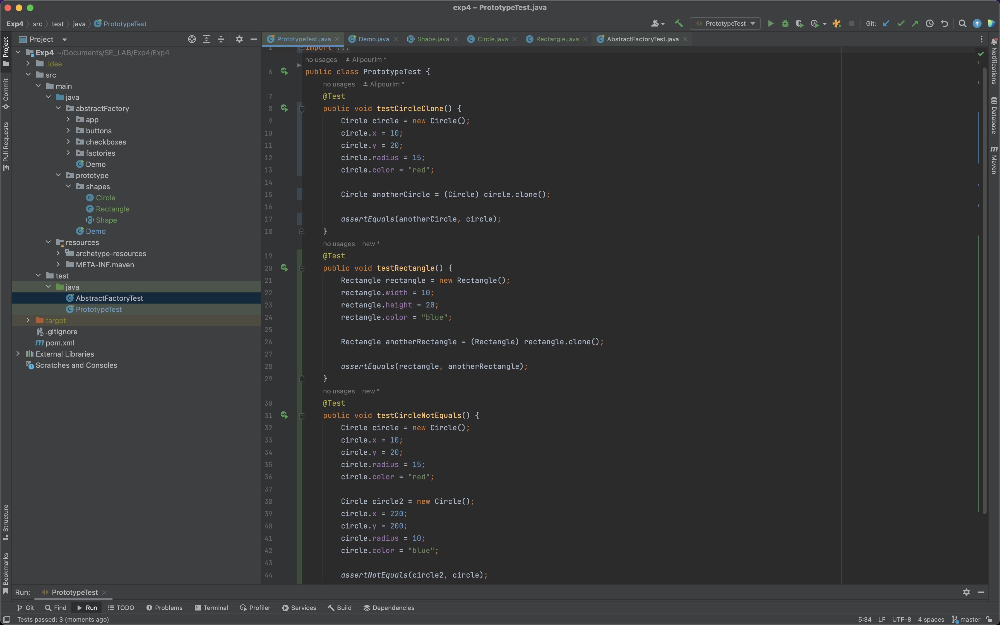
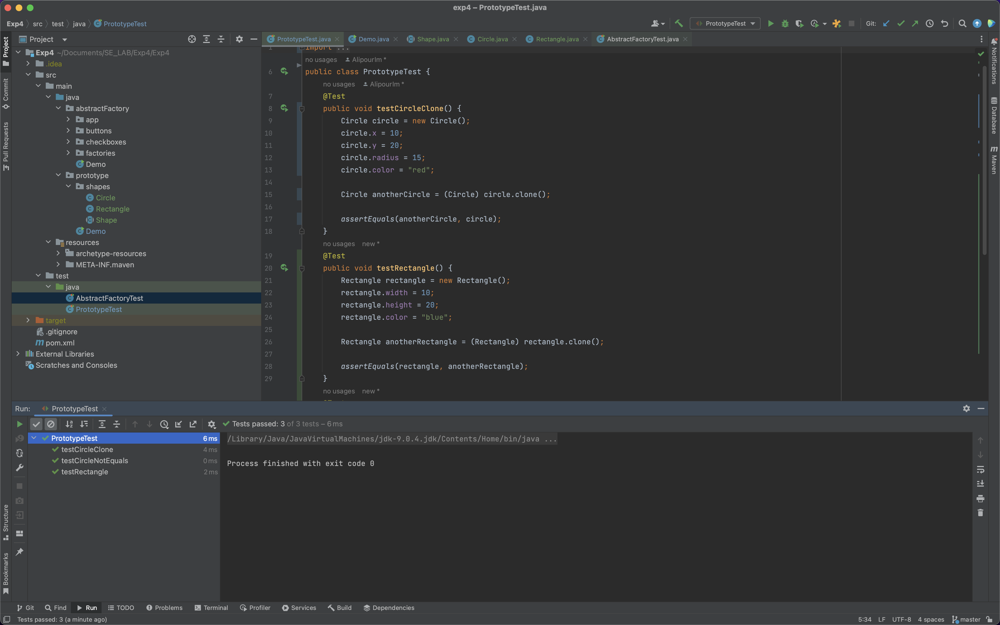
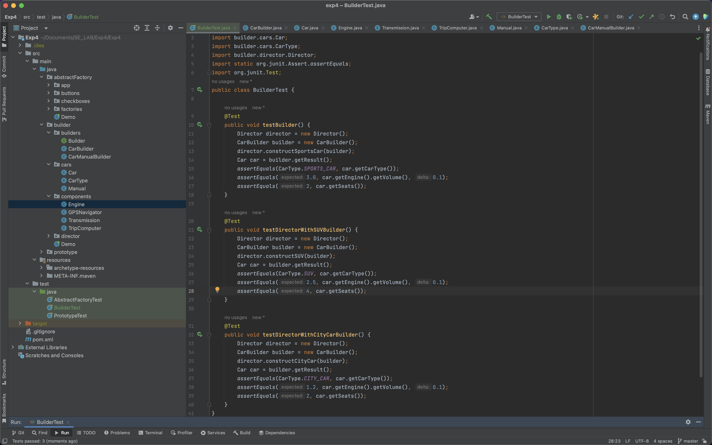
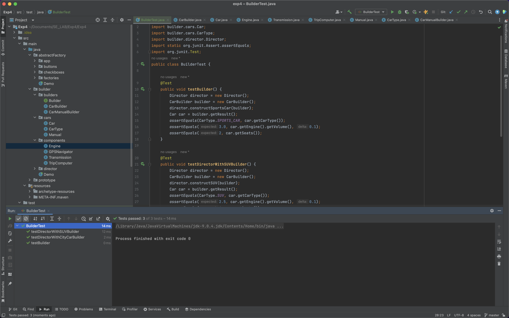

# software-engineering-lab-session6

| `Person Number` | `First Name`  |  `Last Name`  | `Student Number` |
  |:-------------:|:-------------:|:----------------:|:----------------:|
| `First Person` |     Iman      |    Alipour    |     98102024     |
| `Second Person` | Moahmmad Taha | Jahani-Nezhad |     98101363     |
---

## بخش اول
در این بخش باید طبق ویدئوی آموزشی که در بخش منابع قرار داده شده است، الگوی طراحی Abstract Factory را پیاده‌سازی کنیم.

این الگوی طراحی برای زمانی استفاده می‌شود که ما می‌خواهیم یک دسته از اشیاء مرتبط بهم و از انواع مختلف بسازیم. برای این کار، یک کلاس انتزاعی Factory می‌سازیم که در آن توابع مربوط به ساختن انواع اشیاء در این دسته وجود دارند. سپس، کلاس‌های Concrete Factory می‌سازیم که هر کدام مسئولیت تولید یک نوع از این دسته اشیاء را دارند.

در مثال پیاده‌سازی شده توسط ما در این آزمایش، که همان مثال ارائه شده در سایت Refactoring Guru می‌باشد، یک نرم افزاری که مسئولیت نمایش رابط کاربری (GUI) را به عهده دارد پیاده‌سازی شده است.

فرض شده که دو نوع المان ظاهری به نام‌های Button و Checkbox داریم و همچنین دو سیستم عامل مختلف Windows و MacOS داریم. هرکدام از این سیستم‌عامل‌ها برای تولید المان‌های ظاهری خود، از یک Concrete Factory استفاده می‌کنند که اینترفیس GUIFactory را پیاده‌سازی می‌کند. این اینترفیس همان Abstract Factory ما می‌یاشد.

در دموی پیاده‌سازی شده نیز،‌با توجه به سیستم عامل کاربر، یک نام برای سیستم عامل انتخاب شده و متناسب با آن، یک Concrete Factory ساخته می‌شود که با استفاده از آن می‌توان المان‌های ظاهری را تولید و استفاده کرد.

پیاده‌سازی این آزمایش به روش TDD بوده؛ یعنی ابتدا با استفاده از اینترفیس‌هایی که در دسترس بودند و با استفاده از نام کلاس‌های مختلف و بدون توجه به پیاده‌سازی آن‌ها، تست‌هایی برای صحت‌سنجی عملکرذ برنامه نوشته شده‌اند که در تصویر زیر قابل مشاهده هستند:

همانطور که مشاهده می‌شود، به دلیل عدم پیاده‌سازی کلاس‌ها، هیچ کدام از تست‌ها اجرا نمی‌شوند و خطای زمان کامپایل نمایش داده می‌شود. عملکرد این تست‌ها نیز ساده می‌باشد. برای دو سیستم‌عامل داده شده، در دو تست مختلف، دو Factory ساخته می‌شود و سپس با استفاده از این Factoryها، المان‌های مختلف ظاهری نیز ساخته می‌شوند و نام آن‌ها با نامی که انتظار آن‌را داشته‌ایم، تطابق می‌یابند.

برای اجرا شدن این تست‌ها، کدهای مربوط به Abstract Factory را اضافه می‌کنیم.
سپس دوباره تست‌ها را از ابتدا اجرا می‌کنیم. این بار مشاهده می‌شود که چون پیاده‌سازی تست‌ها و پیاده‌سازی خود پروژه کاملا به درستی انجام شده و از نظر معنایی اشکالی در آن‌ها وجود ندارد، همه‌ی تست‌ها به درستی پاس می‌شوند:


### بخش دوم
در این بخش می‌خواهیم الگوی طراحی Prototype را پیاده‌سازی و استفاده کنیم. در این الگوی طراحی، ما تلاش می‌کنیم تا از روی اشیاء با انواع مختلف، کپی بسازیم. برای ساختن کپی‌هایی که کاملا منطبق با خود شی اصلی باشند، مجبوریم یک تابع بنویسیم و با استفاده از نوع شی، و با استفاده از عبارات شرطی، یک کپی از شی ایجاد کنیم.
ایراد اصلی این کار، وابسته بودن کد به اشیاء و هم‌چنین مشکل private بودن بعضی از فیلدهای شی می‌باشد که عملا کپی کردن را غیر ممکن می‌کند.

در الگوی طراحی Prototype، پیشنهاد می‌شود که برای هر کلاس یک تابع `clone()` تعریف کنیم و در خروجی آن، یک شیء کپی شده خروجی دهیم. منطق نحوه‌ی کپی برای هر کلاس به خود همان کلاس بستگی خواهد داشت و همچنین معضل private بودن فیلدها نیز برطرف می‌شود.

در این پروژه، یک پکیج shapes داریم. کلاس Shape یک کلاس انتزاعی می‌باشد که مهم‌ترین متد آن برای ما، متد `clone()` می‌باشد که به صورت ابسترکت تعریف شده و فرزندان این کلاس باید آن‌را پیاده‌سازی کنند.
مابقی کلاس‌های Concrete که شامل کلاس‌های Circle و Rectangle می‌باشند، این تابع را به نحوی پیاده‌سازی کرده‌اند که شی‌ای که در خروجی داده می‌شود، مقدار فیلدهای برابری با شی اصلی داشته باشد.
به عنوان مثال، قطعه کد زیر پیاده‌سازی این تابع در کلاس Rectangle می‌باشد:
```java
public Rectangle(Rectangle target) {
    super(target);
    if (target != null) {
        this.width = target.width;
        this.height = target.height;
    }
}

@Override
public Shape clone() {
    return new Rectangle(this);
}
```
همانطور که مشاهده می‌شود، یک کانستراکتور در این کلاس وجود دارد که یک Rectangle دیگر دریافت کرده و مقادیر فیدهای آن‌را در شیء جدید کپی می‌کند. با استفاده از همین کانستراکتور، تابع clone پیاده‌سازی شده است.

_نکته_: توجه کنید که روند پیاده‌سازی این آزمایش مطابق روش TDD خواسته شده در دستورکار بوده و ابتدا تست‌ها پیاده‌سازی شده و در هر مرحله Compile ارورهای آن‌ها برطرف شده تا این کدها تشکیل شده‌اند.

کدهای مربوط به تست این کلاس‌ها در تصویر زیر نمایش داده شده‌اند:

در این تست‌ها، از هر کلاس Concrete که در پکیج وجود دارد، یک Clone ساخته شده و سپس یکتا بودن آن با شی اصلی سنجیده می‌شود.
توجه کنید که برای سنجش یکتایی دو شی، از تابع `equals()` استفاده می‌شود که این تابع نیز در هر کلاس به طور مجزا پیاده‌سازی شده است.
در تست آخر نیز، برای اینکه صحت و درستی تابع `equals()` سنجیده شود، دو دایره‌ی متفاوت با مقادیر متفاوت ساخته شده‌اند و نابرابری آن‌ها سنجیده شده است.

پس از اجرای تست‌ها، میبینیم که همه چیز به درستی اجرا شده و همه‌ی تست‌ها پاس می‌شوند:


### بخش سوم
در این بخش از ما خواسته شده تا الگوی طراحی Builder را در قالب یک مثال پیاده‌سازی کنیم.
این الگوی طراحی زمانی استفاده می‌شود که بخواهیم یک شی با فیلدهای متغیر زیادی بسازیم؛ به طوری که مقدار همه‌ی فیلدها قابل تنظیم باشند و این شی به طور وسیعی قابل تنظیم باشد.
برای جلوگیری از طولانی شدن لیست آرگومان‌های توابع، از این الگوی طراحی استفاده می‌شود.
برای هر کلاس Concrete، یک کلاس Builder تعریف می‌کنیم که در آن یک سری توابع setter تعریف شده و همچنین یک کلاس Director نیز داریم که یک Builder دریافت می‌کند و انواع مجموعه مقادیر مختلف قابل قبول برای فیلدهای کلاس را تنظیم می‌کند و یک شیء معنی‌دار در خروجی می‌دهد.

در کدهای مودجود در پوشه builder، کلاس‌های درون پکیج‌های cars و components مربوط به همان کلاس‌های تنظیم‌پذیری هستند که فیلدهای زیادی دارند.
به ازای هر کلاس concrete درون پکیج cars، یک کلاس builder داریم که توابع مربوط به مقداردهی این فیلدها را به عهده دارد.

در پکیج director، تنها یک کلاس Director داریم. در این کلاس، توابعی وجود دارد که انواع مختلفی از Car را تولید می‌کند. هر نوع Car، یک مجموعه‌ی قابل از قبولی از مقدارهای فیلدها دارد. به عنوان مثال، یک ماشین اسپورت، دو صندلی، موتور ۳ لیتری و یک GPS دارد.
در واقع کلاس director مسئولیت کار کردن با Builder و صدا زدن توابع آن‌را به عهده دارد.

_نکته_: در نوع دیگری از پیاده‌سازی این الگو، کلاس Director وجود ندارد. همچنین، در توابع داخل کلاس Builder، خود شی builder برگردانده می‌شود. این کار امکان زنجیره‌ای صدا زدن توابع را به ما می‌دهد.

در تصویر زیر، تست‌های مربوط به این الگو قابل مشاهده هستند:


در این تست‌ها، صرفا توابع داخل کلاس Director صدا زده شده و مقادیر داخل شی خروجی داده شده با مقادیر مورد انتظار سنجیده شده‌اند.

پس از اجرای تست‌ها مشاهده می‌کنیم که در منطق کدها ایرادی وجود ندارد و همه‌ی تست‌ها پاس می‌شوند:
