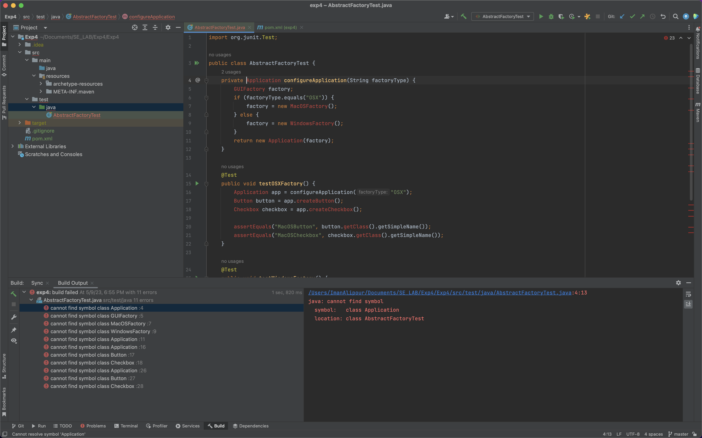
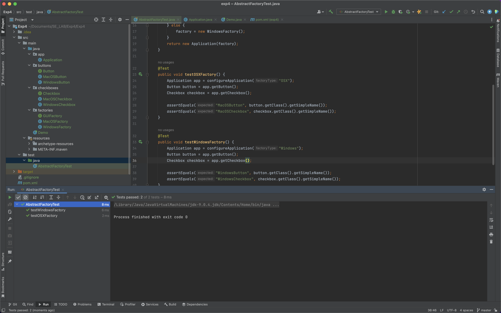

# software-engineering-lab-session6

| `Person Number` | `First Name`  |  `Last Name`  | `Student Number` |
  |:-------------:|:-------------:|:----------------:|:----------------:|
| `First Person` |     Iman      |    Alipour    |     98102024     |
| `Second Person` | Moahmmad Taha | Jahani-Nezhad |     98101363     |
---

## بخش اول
در این بخش باید طبق ویدئوی آموزشی که در بخش منابع قرار داده شده است، الگوی طراحی Abstract Factory را پیاده‌سازی کنیم.

این الگوی طراحی برای زمانی استفاده می‌شود که ما می‌خواهیم یک دسته از اشیاء مرتبط بهم و از انواع مختلف بسازیم. برای این کار، یک کلاس انتزاعی Factory می‌سازیم که در آن توابع مربوط به ساختن انواع اشیاء در این دسته وجود دارند. سپس، کلاس‌های Concrete Factory می‌سازیم که هر کدام مسئولیت تولید یک نوع از این دسته اشیاء را دارند.

در مثال پیاده‌سازی شده توسط ما در این آزمایش، که همان مثال ارائه شده در سایت Refactoring Guru می‌باشد، یک نرم افزاری که مسئولیت نمایش رابط کاربری (GUI) را به عهده دارد پیاده‌سازی شده است.

فرض شده که دو نوع المان ظاهری به نام‌های Button و Checkbox داریم و همچنین دو سیستم عامل مختلف Windows و MacOS داریم. هرکدام از این سیستم‌عامل‌ها برای تولید المان‌های ظاهری خود، از یک Concrete Factory استفاده می‌کنند که اینترفیس GUIFactory را پیاده‌سازی می‌کند. این اینترفیس همان Abstract Factory ما می‌یاشد.

در دموی پیاده‌سازی شده نیز،‌با توجه به سیستم عامل کاربر، یک نام برای سیستم عامل انتخاب شده و متناسب با آن، یک Concrete Factory ساخته می‌شود که با استفاده از آن می‌توان المان‌های ظاهری را تولید و استفاده کرد.

پیاده‌سازی این آزمایش به روش TDD بوده؛ یعنی ابتدا با استفاده از اینترفیس‌هایی که در دسترس بودند و با استفاده از نام کلاس‌های مختلف و بدون توجه به پیاده‌سازی آن‌ها، تست‌هایی برای صحت‌سنجی عملکرذ برنامه نوشته شده‌اند که در تصویر زیر قابل مشاهده هستند:

همانطور که مشاهده می‌شود، به دلیل عدم پیاده‌سازی کلاس‌ها، هیچ کدام از تست‌ها اجرا نمی‌شوند و خطای زمان کامپایل نمایش داده می‌شود. عملکرد این تست‌ها نیز ساده می‌باشد. برای دو سیستم‌عامل داده شده، در دو تست مختلف، دو Factory ساخته می‌شود و سپس با استفاده از این Factoryها، المان‌های مختلف ظاهری نیز ساخته می‌شوند و نام آن‌ها با نامی که انتظار آن‌را داشته‌ایم، تطابق می‌یابند.

برای اجرا شدن این تست‌ها، کدهای مربوط به Abstract Factory را اضافه می‌کنیم.
سپس دوباره تست‌ها را از ابتدا اجرا می‌کنیم. این بار مشاهده می‌شود که چون پیاده‌سازی تست‌ها و پیاده‌سازی خود پروژه کاملا به درستی انجام شده و از نظر معنایی اشکالی در آن‌ها وجود ندارد، همه‌ی تست‌ها به درستی پاس می‌شوند:
